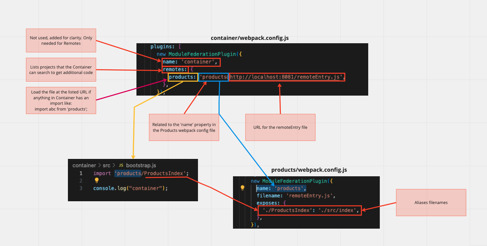

# Microfrontend Module Federation

Basic javascript app using ModuleFederationPlugin with 2 subapps and 1 container

## Udemy Tutorial

Section 1 - 3 w/o react

[Microfrontends with React: A Complete Developer's Guide](https://www.udemy.com/course/microfrontend-course/)

### App Flow - how teams start locally

#### Team #1 Products: (develop in isolation)

- `npm start` in *products*
- localhost:8081
- index.js & index.html (note: index.html only used during development of product)

#### Team #2 Cart: (develop in isolation)

- `npm start` in *cart*
- localhost:8082
- index.js & index.html (note: index.html only used during development of cart)

#### Team #3 Container: (crossover)

- `npm start’` in all **three** projects
- localhost:8080
- index.js, bootstrap.js & index.html (note: index.html used during development and production)

#### Run-Time vs. Build-Time

- Build-Time integrations give the container access to a child app’s source code **before** it is loaded in the browser.

- Run-Time integrations give the container access to a child app’s source code **after** it is loaded in the browser.

#### The Goal of Webpack

*Combines many JS files into one single file*

Webpack Dev Server - Makes output easily available to the browser

```

update webpack.config.js

devServer: {
    port: 8081,
  },

Update package.json script:

"scripts": {
    "start": "webpack serve"
  },
```

##### HtmlWebpackPlugin

- Takes a look at the different files coming out of webpack and the names associated with the files and automatically update the html script tags to add a script for each file with the correct name.

```

const HtmlWebpackPlugin = require('html-webpack-plugin');

module.exports = {
  mode: 'development',
  devServer: {
    port: 8081,
  },
  plugins: [
    new HtmlWebpackPlugin({
      template: './public/index.html',
    }),
  ],
};

```


